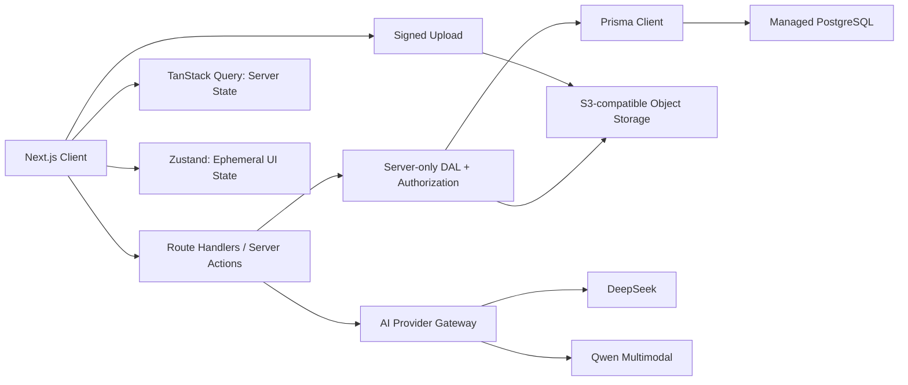
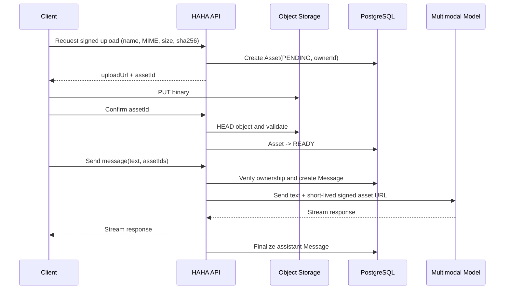

# HAHA-Note 完整迁移方案

> 文档版本：1.0  
> 编写日期：2026-07-24  
> 迁移目标：MongoDB + Redux/RTK Query -> 托管 PostgreSQL + Prisma + TanStack Query + Zustand  
> 基线仓库：`chenruiiiii/HAHA-Note@7a7237f9fbd6133788d2332064a18d9692c479c8`  
> 多模态参考：`Hii897/vision-talk@8afdbf948729253a7ca22594e6fab8ac427c5a9b`

## 1. 文档目的

本文档用于指导 HAHA-Note 在不中断现有产品演进的前提下完成以下工作：

1. 将分散在多个 MongoDB database/collection 中的数据迁移到托管 PostgreSQL。
2. 使用 Prisma 建立可审查、可迁移、类型安全的数据访问层。
3. 将 Redux 的职责拆分为 TanStack Query 服务端状态与 Zustand 客户端状态。
4. 删除笔记正文的 `localStorage` 持久化，确保笔记以云端数据库为唯一权威来源。
5. 为接入 vision-talk 的图片、摄像头、语音和多模态会话能力预留正式数据模型。
6. 同步解决当前鉴权绕过、明文密码、数据无归属和 HTML 注入等上线阻塞问题。

本文档不是一次依赖替换清单，而是一套可分阶段执行、验证和回滚的线上数据迁移方案。

## 2. 最终决策

### 2.1 采用的技术方案

| 领域 | 目标方案 | 说明 |
| --- | --- | --- |
| 数据库 | 托管 PostgreSQL | 开发、预发布和生产分别使用独立云数据库或数据库分支 |
| ORM | Prisma 7 | 使用 Prisma Schema、Prisma Client 和 Prisma Migrate |
| 服务端状态 | TanStack Query 5 | 请求、缓存、失效、重试和乐观更新 |
| 客户端状态 | Zustand 5 | UI、设备权限和短生命周期交互状态 |
| 编辑器正文 | PostgreSQL `Json`/JSONB | TipTap JSON 是权威格式，过滤后的 HTML 仅作兼容缓存 |
| 多媒体 | S3 兼容对象存储 | PostgreSQL 只保存对象 key、MIME、大小、归属等元数据 |
| 鉴权 | 数据访问层强制鉴权 | HttpOnly Cookie + 服务端 Session/Refresh Token 哈希 |
| 部署 | 维护窗口一次性迁移 | 当前规模下不引入长期双写 |

### 2.2 明确不采用的方案

- 不采用 SQLite，包括开发环境中的笔记数据。
- 不把 vision-talk 当前 SQLite 配置复制进 HAHA-Note。
- 不使用 Zustand 替代 TanStack Query 管理知识库、文档和会话缓存。
- 不使用 Zustand `persist`、`localStorage`、`sessionStorage` 或 IndexedDB 保存笔记正文。
- 不把 Base64 图片、摄像头帧、音频 Blob 或 `MediaStream` 持久化到 Zustand 或 PostgreSQL。
- 不长期维护 MongoDB/PostgreSQL 双写。
- 不在第一次迁移中加入多人实时协同、离线编辑和向量检索。

### 2.3 关键取舍

严格禁止本地正文持久化意味着：浏览器崩溃或断网时，尚未成功提交到服务端的内容无法做到百分之百恢复。产品需要通过高频自动保存、显式保存状态、失败重试和离页提示降低风险，不能对用户承诺离线恢复。

## 3. 当前系统盘点

### 3.1 当前技术栈

- Next.js 16.1.3、React 19.2.3、TypeScript 5.9。
- MongoDB Node Driver 7.1，API Route Handler 直接操作 collection。
- Redux Toolkit、React Redux、RTK Query。
- TipTap 3，当前文档主要存储 `content_html`。
- AI SDK 6、DeepSeek、Sentry。

### 3.2 当前 MongoDB 数据分布

| MongoDB database.collection | 当前用途 | PostgreSQL 目标 |
| --- | --- | --- |
| `ha_admin.users` | 后台账号，当前密码为明文 | `User`、`Session` |
| `repository.repo_list` | 知识库及内嵌 `docs_list` | `Repository`、`RepositoryMember`、`RepositoryFavorite` |
| `repository.docs_detail` | 文档标题、HTML、摘要 | `Document`、`DocumentRevision` |
| `ai-chat.ai_chat_detail` | 当前运行时会话及内嵌消息数组 | `Conversation`、`Message`、`Asset`、`MessageAsset` |
| `ai-chat.ai_mission_detail` | 旧种子脚本写入的会话详情 | 作为迁移补充源，不单独建表 |
| `ai-chat.latest_mission` / `collect_mission` | 当前运行时列表/收藏冗余数据 | 不迁表，由 Conversation 查询得出 |
| `ai-chat.最近任务` / `收藏任务` | 旧种子脚本写入的列表数据 | 只用于完整性校验 |
| `user_activity.edit_history` | 编辑历史 | `Activity` |
| `user_activity.browse_history` | 浏览历史 | `Activity` |
| `stroll-recommend.recommend_details` | 逛逛内容 | `ExploreArticle` |

### 3.3 当前 16 个 API

核心数据接口包括：知识库列表/详情、文档详情/摘要、最近编辑/浏览、AI 会话列表/详情/流式生成、登录/刷新/退出、公开笔记和逛逛推荐。

当前主要问题：

1. 多数查询没有用户过滤条件，所有登录用户可能看到同一批数据。
2. `proxy()` 直接 `NextResponse.next()`，实际绕过鉴权。
3. 登录接口在请求期间写入固定默认账号，且使用明文密码。
4. 部分错误仍返回 HTTP 200，只在 JSON `code` 中表达失败。
5. `repo_list.docs_list` 与 `docs_detail` 双份维护，容易不一致。
6. `latest_mission` 与真实会话重复存储。
7. AI 运行时 API 和种子脚本使用了两组不同的 collection 名称。
8. `content_html` 和公开内容缺少统一的服务端过滤边界。
9. `useTapEditor.ts` 将 `final-note-data` 写入 `localStorage`，不符合目标数据策略。

### 3.4 当前 Redux 职责

| 模块 | 当前职责 | 目标 |
| --- | --- | --- |
| `repository.ts` | RTK Query 知识库列表/创建 | TanStack Query |
| `user_history.ts` | RTK Query 编辑/浏览历史 | TanStack Query |
| `repoDetail.ts` | 手写 TTL、请求去重、收藏同步、目录缓存 | TanStack Query |
| `chat.ts` | AI 请求状态 | AI Hook 局部状态或 Zustand UI Store |
| `temp.ts` | 临时 AI 输入 | URL 参数或非持久化 Zustand |

`repoDetail.ts` 已经在手动解决服务端缓存、失效和乐观更新问题，因此不能原样迁入 Zustand。

## 4. 目标架构



### 4.1 目录边界

建议目标目录：

```text
app/
  api/
src/
  generated/prisma/       # prisma generate 产物，不手改
  lib/
    prisma.ts
    auth/
    storage/
  server/
    dal/                   # 只能在服务端使用，统一鉴权和数据库访问
    dto/                   # 返回给客户端的最小数据结构
    services/              # 文档、会话、AI、对象存储业务逻辑
  queries/                 # TanStack Query keys、options、mutations
  stores/                  # 只放客户端瞬时状态
  features/
    editor/
    repository/
    chat/
    multimodal/
prisma/
  schema.prisma
  migrations/
  seed.ts
scripts/
  migrate-mongo-to-postgres.ts
  validate-migration.ts
  reverse-sync-cutover-data.ts
```

约束：`src/server/**` 和 `src/lib/prisma.ts` 必须引入 `server-only`，客户端组件不得直接引用 Prisma 类型实现或数据库服务。

## 5. 目标数据模型

以下为最终态 Schema。首次迁移时 `Document.content` 可暂时设为 `Json?`，完成 HTML 转换和验证后再通过第二个 migration 改为非空。

```prisma
generator client {
  provider = "prisma-client"
  output   = "../src/generated/prisma"
}

datasource db {
  provider = "postgresql"
}

enum UserRole {
  USER
  ADMIN
}

enum RepositoryRole {
  OWNER
  EDITOR
  VIEWER
}

enum Visibility {
  PRIVATE
  UNLISTED
  PUBLIC
}

enum DocumentStatus {
  DRAFT
  PUBLISHED
  ARCHIVED
}

enum ConversationStatus {
  ACTIVE
  ARCHIVED
}

enum MessageRole {
  SYSTEM
  USER
  ASSISTANT
  TOOL
}

enum MessageStatus {
  PENDING
  STREAMING
  COMPLETED
  FAILED
  CANCELLED
}

enum AssetKind {
  IMAGE
  AUDIO
  VIDEO
  FILE
}

enum AssetStatus {
  PENDING
  READY
  REJECTED
  DELETED
}

enum ActivityType {
  DOCUMENT_VIEWED
  DOCUMENT_UPDATED
  DOCUMENT_CREATED
  DOCUMENT_SHARED
  AI_MESSAGE_SENT
}

model User {
  id                   String               @id @default(cuid())
  username             String               @unique @db.VarChar(50)
  email                String?              @unique @db.VarChar(254)
  passwordHash         String               @map("password_hash")
  nickname             String               @db.VarChar(80)
  avatarUrl             String?              @map("avatar_url")
  role                  UserRole             @default(USER)
  enabled               Boolean              @default(true)
  passwordResetRequired Boolean              @default(false) @map("password_reset_required")
  createdAt             DateTime             @default(now()) @map("created_at")
  updatedAt             DateTime             @updatedAt @map("updated_at")
  sessions              Session[]
  ownedRepositories     Repository[]         @relation("RepositoryOwner")
  repositoryMemberships RepositoryMember[]
  createdDocuments      Document[]           @relation("DocumentCreator")
  createdRevisions      DocumentRevision[]   @relation("RevisionCreator")
  repositoryFavorites  RepositoryFavorite[]
  documentFavorites    DocumentFavorite[]
  createdShareLinks     DocumentShareLink[]  @relation("ShareCreator")
  conversations         Conversation[]
  assets                Asset[]
  activities            Activity[]

  @@map("users")
}

model Session {
  id               String    @id @default(cuid())
  userId           String    @map("user_id")
  refreshTokenHash String    @unique @map("refresh_token_hash")
  expiresAt        DateTime  @map("expires_at")
  revokedAt        DateTime? @map("revoked_at")
  userAgent        String?   @map("user_agent")
  ipHash           String?   @map("ip_hash")
  createdAt        DateTime  @default(now()) @map("created_at")
  user             User      @relation(fields: [userId], references: [id], onDelete: Cascade)

  @@index([userId, expiresAt])
  @@map("sessions")
}

model Repository {
  id          String               @id @default(cuid())
  ownerId     String               @map("owner_id")
  title       String               @db.VarChar(120)
  description String               @default("") @db.Text
  type        String               @default("book") @db.VarChar(30)
  visibility  Visibility           @default(PRIVATE)
  coverUrl    String?              @map("cover_url")
  createdAt   DateTime             @default(now()) @map("created_at")
  updatedAt   DateTime             @updatedAt @map("updated_at")
  deletedAt   DateTime?            @map("deleted_at")
  owner       User                 @relation("RepositoryOwner", fields: [ownerId], references: [id])
  members     RepositoryMember[]
  documents   Document[]
  favorites   RepositoryFavorite[]
  conversations Conversation[]

  @@index([ownerId, updatedAt])
  @@map("repositories")
}

model RepositoryMember {
  repositoryId String         @map("repository_id")
  userId       String         @map("user_id")
  role         RepositoryRole @default(VIEWER)
  createdAt    DateTime       @default(now()) @map("created_at")
  repository   Repository     @relation(fields: [repositoryId], references: [id], onDelete: Cascade)
  user         User           @relation(fields: [userId], references: [id], onDelete: Cascade)

  @@id([repositoryId, userId])
  @@index([userId])
  @@map("repository_members")
}

model RepositoryFavorite {
  userId       String     @map("user_id")
  repositoryId String     @map("repository_id")
  createdAt    DateTime   @default(now()) @map("created_at")
  user         User       @relation(fields: [userId], references: [id], onDelete: Cascade)
  repository   Repository @relation(fields: [repositoryId], references: [id], onDelete: Cascade)

  @@id([userId, repositoryId])
  @@index([repositoryId])
  @@map("repository_favorites")
}

model Document {
  id            String             @id @default(cuid())
  repositoryId  String             @map("repository_id")
  creatorId     String             @map("creator_id")
  title         String             @default("新建文档") @db.VarChar(200)
  content       Json
  contentHtml   String?            @map("content_html") @db.Text
  contentText   String             @default("") @map("content_text") @db.Text
  summary       String             @default("") @db.Text
  version       Int                @default(1)
  status        DocumentStatus     @default(DRAFT)
  createdAt     DateTime           @default(now()) @map("created_at")
  updatedAt     DateTime           @updatedAt @map("updated_at")
  publishedAt   DateTime?          @map("published_at")
  deletedAt     DateTime?          @map("deleted_at")
  repository    Repository         @relation(fields: [repositoryId], references: [id], onDelete: Cascade)
  creator       User               @relation("DocumentCreator", fields: [creatorId], references: [id])
  revisions     DocumentRevision[]
  favorites     DocumentFavorite[]
  shareLinks    DocumentShareLink[]
  conversations Conversation[]
  activities    Activity[]

  @@index([repositoryId, updatedAt])
  @@index([creatorId, updatedAt])
  @@map("documents")
}

model DocumentRevision {
  id          String   @id @default(cuid())
  documentId  String   @map("document_id")
  createdById String   @map("created_by_id")
  version     Int
  title       String   @db.VarChar(200)
  content     Json
  contentHtml String?  @map("content_html") @db.Text
  summary     String   @default("") @db.Text
  createdAt   DateTime @default(now()) @map("created_at")
  document    Document @relation(fields: [documentId], references: [id], onDelete: Cascade)
  createdBy   User     @relation("RevisionCreator", fields: [createdById], references: [id])

  @@unique([documentId, version])
  @@index([createdById, createdAt])
  @@map("document_revisions")
}

model DocumentFavorite {
  userId     String   @map("user_id")
  documentId String   @map("document_id")
  createdAt  DateTime @default(now()) @map("created_at")
  user       User     @relation(fields: [userId], references: [id], onDelete: Cascade)
  document   Document @relation(fields: [documentId], references: [id], onDelete: Cascade)

  @@id([userId, documentId])
  @@index([documentId])
  @@map("document_favorites")
}

model DocumentShareLink {
  id          String     @id @default(cuid())
  documentId  String     @map("document_id")
  createdById String     @map("created_by_id")
  tokenHash   String     @unique @map("token_hash")
  expiresAt   DateTime?  @map("expires_at")
  revokedAt   DateTime?  @map("revoked_at")
  createdAt   DateTime   @default(now()) @map("created_at")
  document    Document   @relation(fields: [documentId], references: [id], onDelete: Cascade)
  createdBy   User       @relation("ShareCreator", fields: [createdById], references: [id])

  @@index([documentId, revokedAt])
  @@map("document_share_links")
}

model Conversation {
  id           String             @id @default(cuid())
  ownerId      String             @map("owner_id")
  repositoryId String?            @map("repository_id")
  documentId   String?            @map("document_id")
  title        String             @default("新建对话") @db.VarChar(200)
  summary      String             @default("") @db.Text
  provider     String             @default("deepseek") @db.VarChar(40)
  model        String             @db.VarChar(100)
  status       ConversationStatus @default(ACTIVE)
  isFavorite   Boolean            @default(false) @map("is_favorite")
  createdAt    DateTime           @default(now()) @map("created_at")
  updatedAt    DateTime           @updatedAt @map("updated_at")
  deletedAt    DateTime?          @map("deleted_at")
  owner        User               @relation(fields: [ownerId], references: [id], onDelete: Cascade)
  repository   Repository?        @relation(fields: [repositoryId], references: [id], onDelete: SetNull)
  document     Document?          @relation(fields: [documentId], references: [id], onDelete: SetNull)
  messages     Message[]

  @@index([ownerId, updatedAt])
  @@index([repositoryId])
  @@index([documentId])
  @@map("conversations")
}

model Message {
  id              String        @id @default(cuid())
  conversationId  String        @map("conversation_id")
  clientMessageId String?       @map("client_message_id") @db.VarChar(120)
  role            MessageRole
  status          MessageStatus @default(COMPLETED)
  content         String        @default("") @db.Text
  parts           Json
  provider        String?       @db.VarChar(40)
  model           String?       @db.VarChar(100)
  errorCode       String?       @map("error_code") @db.VarChar(80)
  promptTokens    Int?          @map("prompt_tokens")
  completionTokens Int?         @map("completion_tokens")
  latencyMs       Int?          @map("latency_ms")
  createdAt       DateTime      @default(now()) @map("created_at")
  updatedAt       DateTime      @updatedAt @map("updated_at")
  conversation    Conversation  @relation(fields: [conversationId], references: [id], onDelete: Cascade)
  assets          MessageAsset[]

  @@unique([conversationId, clientMessageId])
  @@index([conversationId, createdAt])
  @@map("messages")
}

model Asset {
  id           String        @id @default(cuid())
  ownerId      String        @map("owner_id")
  kind         AssetKind
  status       AssetStatus   @default(PENDING)
  storageKey   String?       @unique @map("storage_key")
  externalUrl  String?       @map("external_url") @db.Text
  originalName String?       @map("original_name") @db.VarChar(255)
  mimeType     String        @map("mime_type") @db.VarChar(120)
  sizeBytes    BigInt?       @map("size_bytes")
  sha256       String?       @db.VarChar(64)
  width        Int?
  height       Int?
  durationMs   Int?          @map("duration_ms")
  createdAt    DateTime      @default(now()) @map("created_at")
  deletedAt    DateTime?     @map("deleted_at")
  owner        User          @relation(fields: [ownerId], references: [id], onDelete: Cascade)
  messages     MessageAsset[]

  @@index([ownerId, createdAt])
  @@map("assets")
}

model MessageAsset {
  messageId String   @map("message_id")
  assetId   String   @map("asset_id")
  position  Int      @default(0)
  analysis  String?  @db.Text
  message   Message  @relation(fields: [messageId], references: [id], onDelete: Cascade)
  asset     Asset    @relation(fields: [assetId], references: [id], onDelete: Cascade)

  @@id([messageId, assetId])
  @@index([assetId])
  @@map("message_assets")
}

model Activity {
  id         String       @id @default(cuid())
  userId     String       @map("user_id")
  documentId String       @map("document_id")
  type       ActivityType
  occurredAt DateTime     @default(now()) @map("occurred_at")
  metadata   Json?
  user       User         @relation(fields: [userId], references: [id], onDelete: Cascade)
  document   Document     @relation(fields: [documentId], references: [id], onDelete: Cascade)

  @@index([userId, type, occurredAt])
  @@index([documentId, occurredAt])
  @@map("activities")
}

model ExploreArticle {
  id              String     @id @default(cuid())
  legacyNumericId String?    @unique @map("legacy_numeric_id")
  sourcePlatform  String     @map("source_platform") @db.VarChar(40)
  sourceTitle     String     @map("source_title") @db.VarChar(200)
  sourceAvatarUrl String?    @map("source_avatar_url")
  authorName      String     @map("author_name") @db.VarChar(100)
  authorAvatarUrl String?    @map("author_avatar_url")
  titleHtml       String     @map("title_html") @db.Text
  descriptionHtml String     @map("description_html") @db.Text
  contentHtml     String     @map("content_html") @db.Text
  qualityLevel    String     @map("quality_level") @db.VarChar(30)
  likeCount       Int        @default(0) @map("like_count")
  commentCount    Int        @default(0) @map("comment_count")
  wordCount       Int        @default(0) @map("word_count")
  sourceUrl       String     @map("source_url") @db.Text
  createdAt       DateTime   @default(now()) @map("created_at")
  updatedAt       DateTime   @updatedAt @map("updated_at")

  @@index([qualityLevel, updatedAt])
  @@map("explore_articles")
}
```

### 5.1 模型说明

- 保留 MongoDB 旧 `_id` 作为新表 `id`，避免 URL 和客户端缓存全部失效。
- 删除 `Repository.docs_list`，目录通过 `Document.repositoryId` 查询。
- 删除 `latest_mission` 冗余表，最近会话按 `Conversation.updatedAt DESC` 查询。
- 收藏是用户关系，不再把 `isCollect` 放在公共知识库记录上。
- `Repository.ownerId` 与 OWNER membership 必须保持一致；转移所有权时在同一事务更新。
- `Document.version` 用于乐观并发控制。
- `DocumentRevision` 不应在每个按键时创建；手动保存、重要 AI 改写或固定时间间隔创建版本。
- `Asset.storageKey` 是新上传文件的正式位置；迁移旧外链时暂存 `externalUrl`。
- `Message.parts` 只保存文本、工具调用和 `assetId` 等稳定引用，不保存临时签名 URL。
- 分享链接只在客户端展示原始 token，数据库保存 token 的 SHA-256 哈希。

## 6. Prisma 与云数据库初始化

### 6.1 环境要求

- Node.js 20.19+、22.12+ 或 24+。
- PostgreSQL 使用三个隔离环境：development、preview/test、production。
- 所有环境均为云端 PostgreSQL，不创建本地 SQLite 文件。
- 生产数据库开启自动备份和时间点恢复。

### 6.2 依赖

```bash
npm install @prisma/client @prisma/adapter-pg pg dotenv
npm install @tanstack/react-query zustand
npm install sanitize-html
npm install prisma tsx @types/pg @types/sanitize-html --save-dev
```

Prisma 7 使用 `prisma-client` generator 和数据库 driver adapter。迁移分支应给 `package.json` 增加 `"type": "module"`，运行现有 scripts 和 `next build` 验证 ESM 兼容性，并锁定 `prisma` 与 `@prisma/client` 相同主版本。

### 6.3 环境变量

```dotenv
# 应用运行时使用连接池地址
DATABASE_URL=postgres://...pooled-host.../haha_note?sslmode=require

# Prisma CLI、迁移、dump/restore 使用直连地址
MIGRATION_DATABASE_URL=postgres://...direct-host.../haha_note?sslmode=require

# 只在数据迁移期间保留，迁移结束后从部署环境删除
MONGODB_URI=mongodb+srv://...

AUTH_TOKEN_SECRET=...
PASSWORD_PEPPER=...

OBJECT_STORAGE_ENDPOINT=...
OBJECT_STORAGE_REGION=...
OBJECT_STORAGE_BUCKET=...
OBJECT_STORAGE_ACCESS_KEY_ID=...
OBJECT_STORAGE_SECRET_ACCESS_KEY=...

DEEPSEEK_API_KEY=...
QWEN_API_KEY=...
```

不得将任何真实环境变量提交到 Git。开发、预发布和生产使用不同密钥。

### 6.4 Prisma CLI 配置

`prisma.config.ts` 让 CLI 使用直连地址：

```ts
import 'dotenv/config';
import { defineConfig, env } from 'prisma/config';

export default defineConfig({
  schema: 'prisma/schema.prisma',
  migrations: {
    path: 'prisma/migrations',
    seed: 'tsx prisma/seed.ts',
  },
  datasource: {
    url: env('MIGRATION_DATABASE_URL'),
  },
});
```

运行时 Prisma Client 使用池化地址：

```ts
import 'server-only';
import { PrismaPg } from '@prisma/adapter-pg';
import { PrismaClient } from '@/generated/prisma/client';

const globalForPrisma = globalThis as unknown as { prisma?: PrismaClient };

const adapter = new PrismaPg({
  connectionString: process.env.DATABASE_URL!,
});

export const prisma =
  globalForPrisma.prisma ??
  new PrismaClient({
    adapter,
  });

if (process.env.NODE_ENV !== 'production') {
  globalForPrisma.prisma = prisma;
}
```

### 6.5 package scripts

```json
{
  "scripts": {
    "db:format": "prisma format",
    "db:validate": "prisma validate",
    "db:generate": "prisma generate",
    "db:migrate": "prisma migrate dev",
    "db:deploy": "prisma migrate deploy",
    "db:studio": "prisma studio",
    "db:seed": "prisma db seed",
    "data:migrate:dry": "tsx scripts/migrate-mongo-to-postgres.ts --dry-run",
    "data:migrate": "tsx scripts/migrate-mongo-to-postgres.ts --execute",
    "data:validate": "tsx scripts/validate-migration.ts"
  }
}
```

## 7. 鉴权和数据隔离必须先完成

数据库迁移不能延续当前“有 Token 即可读取全部数据”的行为。

### 7.1 必改项

1. 删除登录请求中的 `ensureAdminSeedData()`。
2. 删除固定的 `admin/admin`、`editor/editor123` 账号密码。
3. 迁移时将旧明文密码转换为 Argon2id/bcrypt 哈希，不把明文写入 PostgreSQL。
4. 对可预测默认密码的账号设置 `passwordResetRequired = true`。
5. 恢复路由层登录判断，但不把 Proxy 当作唯一安全边界。
6. 在 DAL 的每次数据读取和写入中校验用户身份、数据所有权或知识库成员权限。
7. Access Token 只保存稳定 `userId`、Session ID 和必要声明，不依赖 username 作为主键。
8. Refresh Token 仅将哈希写入 `Session`，支持轮换、撤销和退出登录。
9. Cookie 继续使用 `HttpOnly`、`Secure`、`SameSite=Lax`，敏感写操作增加 Origin/CSRF 校验。

### 7.2 DAL 规则

所有文档查询都必须表达权限条件，例如：

```ts
const session = await requireUser();

const document = await prisma.document.findFirst({
  where: {
    id: documentId,
    deletedAt: null,
    repository: {
      OR: [
        { ownerId: session.userId },
        { members: { some: { userId: session.userId } } },
      ],
    },
  },
});
```

禁止从请求 body 接受并信任 `ownerId`、`creatorId` 或 `author`。这些字段必须来自服务端 Session。

## 8. MongoDB 到 PostgreSQL 数据迁移

### 8.1 迁移策略

采用“预发布反复演练 + 生产短维护窗口 + 一次性切换”。不做长期双写，原因是当前产品规模下，双写的补偿事务和一致性成本高于短维护窗口成本。

迁移工具必须满足：

- 幂等：重复执行不会重复插入。
- 可中断：按实体分批提交，记录 checkpoint。
- 可审计：每批输出读取、成功、跳过、失败数量。
- 保守：发现未知结构、孤儿关系或 HTML 转换失败时进入 quarantine，不静默丢弃。
- 可验证：源数据和目标数据有计数、关系和内容指纹报告。

### 8.2 迁移前快照

生产迁移前必须同时保留：

```bash
mongodump --uri "$MONGODB_URI" --archive=haha-note-before-cutover.archive --gzip
pg_dump "$MIGRATION_DATABASE_URL" --format=custom --file=postgres-before-cutover.dump
```

命令应在受控迁移 runner 上执行。备份文件立即上传到受限的远程备份位置，不提交到仓库，不留在浏览器、普通开发目录或个人同步盘。

### 8.3 用户映射

当前业务数据没有可靠的 `ownerId`。迁移前需要确定归属规则：

1. 为现有真实用户创建 PostgreSQL `User`。
2. 如果现有所有内容都属于项目作者，建立一个明确的 `legacyOwnerId` 并全部归属该用户。
3. `creator: 张三/李思/王五` 等展示文本不能直接当作身份主键。
4. 无法判断归属的数据进入迁移报告，不能默认变成所有用户可见。

### 8.4 字段映射

#### 用户

| Mongo 字段 | PostgreSQL 字段 | 处理 |
| --- | --- | --- |
| `username` | `User.username` | 保留并唯一化 |
| `password` | `User.passwordHash` | 迁移脚本内哈希，禁止落盘明文 |
| `nickname` | `User.nickname` | 原样保留 |
| `role` | `User.role` | `admin` -> `ADMIN`，其他 -> `USER` |
| `enabled` | `User.enabled` | 原样保留 |
| `created_at/updated_at` | DateTime | 严格解析，失败进入报告 |

#### 知识库和文档

| Mongo 字段 | PostgreSQL 字段 | 处理 |
| --- | --- | --- |
| repository `_id` | `Repository.id` | 原样保留 |
| `title` | `Repository.title` | trim，空值拒绝 |
| `repo_desc`/`description` | `Repository.description` | 以 `repo_desc` 优先 |
| `isPublic` | `Repository.visibility` | true -> PUBLIC，false -> PRIVATE |
| `isCollect` | `RepositoryFavorite` | 为迁移归属用户创建关系 |
| `avatar[0]` | `Repository.coverUrl` | 有值才写入 |
| `docs_list` | 不直接落表 | 用于和 `docs_detail` 做一致性校验 |
| document `_id` | `Document.id` | 原样保留 |
| `repository_id` | `Document.repositoryId` | 必须存在目标 Repository |
| `title` | `Document.title` | 原样保留 |
| `content_html` | `contentHtml` + `content` | 先过滤 HTML，再用 TipTap schema-aware parser 转 JSON |
| `summary` | `Document.summary` | 原样保留 |
| `author` | 不作为身份 | `creatorId` 使用迁移归属用户 |
| `updated_at` | `Document.updatedAt` | 支持当前多种日期格式，失败进入报告 |

`docs_list` 中存在但 `docs_detail` 缺失的条目：创建空的 `DRAFT` 文档，并在报告中标记 `MISSING_DETAIL`。`docs_detail` 存在但目录中缺失的条目：以 `docs_detail.repository_id` 为准迁移，并标记 `MISSING_DIRECTORY_ENTRY`。

每个迁移成功的文档创建初始 `DocumentRevision(version=1)`；后续保存从 version 2 开始。Mongo 没有可靠 `created_at` 时，`createdAt` 使用可解析的 `updated_at`，并在报告中标记时间来源。

#### AI 会话

| Mongo 字段 | PostgreSQL 字段 | 处理 |
| --- | --- | --- |
| `_id` | `Conversation.id` | 原样保留 |
| `title` | `Conversation.title` | 原样保留 |
| `summary` | `Conversation.summary` | 原样保留 |
| `category=favorite` | `Conversation.isFavorite` | 转为布尔值 |
| `types[]` | `Message[]` | 按原顺序拆行 |
| message `id` | `Message.id` | 原样保留，冲突时报告 |
| message `role` | `Message.role` | 映射枚举 |
| message `parts` | `Message.parts` | 保留结构化 JSON |
| text/markdown part | `Message.content` | 提取可搜索纯文本 |
| image URL | `Asset.externalUrl` | 建立 `Asset` 和 `MessageAsset` |

会话详情来源优先级如下：

1. `ai_chat_detail` 是当前运行时写入源，优先级最高。
2. `ai_mission_detail` 只补充运行时集合中不存在的 ID。
3. 同一 ID 在两个详情集合中的正文不一致时，不自动合并，记录 `CHAT_DETAIL_CONFLICT` 并人工确认。
4. `latest_mission`、`collect_mission`、`最近任务`、`收藏任务` 只用于核对标题和收藏状态，不迁移为独立表。
5. 只有列表项而没有任何详情的会话进入 quarantine；不得创建内容不明的“假会话”。

旧会话没有模型字段时统一迁移为 `provider=deepseek`、`model=deepseek-chat`。旧外链图片无法获得可靠大小时允许 `Asset.sizeBytes=null`，但新上传资源必须有大小。

#### 活动和逛逛

- 编辑和浏览历史分别映射为 `DOCUMENT_UPDATED`、`DOCUMENT_VIEWED`。
- 引用不存在文档的模拟历史不进入正式 Activity 表，记录为 orphan 并跳过。
- `recommend_details` 映射为 `ExploreArticle`，所有 HTML 在写入前过滤。

### 8.5 HTML 到 TipTap JSON

禁止使用正则表达式把 HTML 转成编辑器 JSON。应使用 TipTap 支持的 HTML parser 和与编辑器完全一致的 extension 集合。

处理顺序：

1. 使用 `sanitize-html` 按允许标签、属性和 URL scheme 过滤。
2. 使用与 `HAEditor` 相同的 TipTap extensions 将 HTML 转为 JSON。
3. 再从 JSON 生成规范 HTML 和纯文本。
4. 保存 `content`、`contentHtml`、`contentText`。
5. 对转换前 HTML、转换后 JSON 分别计算 SHA-256，写入迁移报告。
6. parser 报错时保留原数据到受限 quarantine 文件并终止生产切换。

首次迁移不能为了通过而静默清空格式。所有生产文档必须达到 100% 可解析，或由人工确认例外处理。

### 8.6 幂等写入与批次

- 使用旧 ID 做 `upsert`。
- 建议批次：Repository 100、Document 100、Conversation 50、Message 500、Activity 500。
- 单个父实体及其直接子实体放入同一 `$transaction`，但不要把全库放进一个长事务。
- 每完成一个批次，写入仅含 ID 和状态的 checkpoint；checkpoint 不得包含正文。
- 遇到唯一键冲突、关系缺失、日期错误立即输出实体 ID 和原因。

### 8.7 验证报告

`validate-migration.ts` 至少输出：

```text
users: source / target / failed
repositories: source / target / failed
documents: source / target / converted / quarantined
conversations: source / target / failed
messages: source nested count / target / failed
assets: source image parts / target links / failed
activities: source / migrated / orphan skipped
explore articles: source / target / failed
foreign key violations: 0
duplicate legacy ids: 0
content conversion failures: 0
```

还需抽样验证：最长文档、包含复杂标题的文档、空文档、收藏知识库、多轮会话、图片消息和公开内容。

## 9. API 迁移

### 9.1 原则

- 第一阶段保留现有 URL，减少前后端同时变化的范围。
- 内部实现统一走 `Route Handler -> DAL -> Service -> Prisma`。
- 输入使用 Zod 校验，输出使用 DTO，禁止把 Prisma record 原样返回。
- DTO 必须把 `BigInt` 转成十进制字符串或安全范围内的 number，避免 JSON 序列化失败。
- HTTP 状态和业务错误一致：400、401、403、404、409、422、429、500。
- 错误响应不得包含数据库异常、连接串或原始 Prisma error。

### 9.2 接口映射

| 当前接口 | 迁移后行为 |
| --- | --- |
| `GET /api/repository` | 查询当前用户拥有或加入的 Repository |
| `POST /api/repository` | 服务端写入 ownerId，并创建 OWNER member |
| `GET /api/repo-detail/:id` | 权限过滤后查询 Repository 和 Documents |
| `POST /api/repo-detail/:id` | 兼容期转为收藏 upsert/delete，之后改 `PUT /favorite` |
| `GET /api/docs-detail/:id` | 权限过滤后返回 Document DTO |
| `POST /api/docs-detail/:id` | 兼容期保存，之后改为 `PUT` 并要求 `baseVersion` |
| `POST /api/docs-summary/:id` | 从服务端读取指定 version 的正文后生成摘要 |
| `GET /api/start/edited` | 从 Activity 查询当前用户最近编辑 |
| `GET /api/start/browsed` | 从 Activity 查询当前用户最近浏览 |
| `GET /api/chat-latest-mission` | 查询当前用户 Conversation，按 updatedAt 排序 |
| `GET /api/chat-collect-mission` | 查询当前用户 `isFavorite=true` 会话 |
| `GET /api/chat/:id` | 读取当前用户会话、消息和附件 DTO |
| `POST /api/chat-detail` | 校验会话归属、附件归属后流式生成并落库 |
| `GET /api/public-note/:id` | 兼容旧公开内容；正式分享改为不可预测 token |
| `GET /api/stroll/left` | 从 ExploreArticle 分页查询 |

### 9.3 文档保存契约

```json
{
  "title": "文档标题",
  "content": { "type": "doc", "content": [] },
  "baseVersion": 12,
  "createRevision": false,
  "requestId": "client-generated-id"
}
```

服务端必须使用原子条件更新：

```text
UPDATE documents
SET content = ..., version = version + 1, updated_at = now()
WHERE id = :id AND version = :baseVersion
```

更新行数为 0 时返回 HTTP 409，并返回最新 `version` 和必要的冲突信息，不直接覆盖服务端内容。

### 9.4 AI 流式消息落库

1. 客户端提交 `conversationId`、`clientMessageId`、文本和 `assetIds`。
2. 服务端校验 Conversation、Document、Asset 都属于当前用户或当前用户有权限。
3. 用户消息先以 `COMPLETED` 写入。
4. 助手消息以 `STREAMING` 写入并返回流。
5. 流结束后更新为 `COMPLETED`，记录 token、延迟、provider/model。
6. 中断或异常更新为 `FAILED`/`CANCELLED`，保留可重试边界。
7. `(conversationId, clientMessageId)` 唯一约束防止网络重试造成重复消息。

不要把整段会话数组在每次请求时覆盖写入。消息应追加或更新单行。

## 10. 编辑器与“正文不落本地”方案

### 10.1 删除现有本地持久化

必须删除 `useTapEditor.ts` 中：

```ts
localStorage.setItem('final-note-data', ...);
localStorage.getItem('final-note-data');
```

不能在首次部署时无提示删除可能仍有价值的旧草稿。应增加一次性兼容迁移：

1. 用户完成登录后只检测 `final-note-data` 是否存在，不在登录前读取或上传正文。
2. 在内存中使用 Zod 校验旧结构；解析失败只提示清理，不把原值写入日志。
3. 明确让用户选择“导入当前账号”或“删除旧本地草稿”，禁止自动上传。
4. 选择导入时，先创建云端 Document；只有服务端确认保存成功后才执行 `localStorage.removeItem('final-note-data')`。
5. 选择删除时二次确认后清理该 key。
6. 兼容入口保留一个发布周期，之后删除读取逻辑和本地保存实现。

如果已经确认该 key 只包含测试数据，可在迁移公告中说明并由用户主动删除。无论哪种路径，都不得把旧本地内容自动绑定到任意当前账号，以免造成跨账号数据泄漏。

### 10.2 自动保存状态机

```text
saved -> dirty -> saving -> saved
                  |  |
                  |  -> conflict
                  -> error -> retrying
offline --------------------> dirty/offline
```

建议行为：

- 内容变化后 800-1200ms debounce。
- 同一文档同时只发送一个保存请求；请求期间发生的新变化进入 latest queue。
- 保存成功后使用服务端返回的 `version` 更新 Query Cache。
- 网络错误指数退避重试，用户也可以手动重试。
- 409 冲突停止自动重试，展示“加载服务端版本/保留当前内容进行人工合并”。
- `pagehide` 的 `keepalive` 只作为兜底，不能成为主要保存机制。
- 存在未保存内容时显示明确状态，并在离页前提示。

### 10.3 浏览器缓存策略

私有文档和会话接口返回：

```http
Cache-Control: private, no-store
Pragma: no-cache
```

客户端请求设置 `cache: 'no-store'`。Service Worker 不缓存私有 API 响应。Sentry breadcrumb、埋点和日志不得记录正文、Prompt 原文、Base64 图片或音频内容。

### 10.4 可以持久化的内容

允许本地持久化的仅限非敏感偏好：主题、侧栏折叠、默认模型、摄像头开关偏好。Zustand `persist` 必须使用 `partialize` 白名单，不能持久化编辑器内容、会话消息、Token、`File`、Blob 或设备流。

TanStack Query 仅使用内存缓存，不接入 `persistQueryClient` 或其他 Query Cache 持久化插件。

## 11. Redux 到 TanStack Query + Zustand

### 11.1 状态归属

| 状态 | 目标位置 |
| --- | --- |
| Repository 列表/详情 | TanStack Query |
| Document 详情/版本/保存 | TanStack Query |
| 收藏、历史、会话列表 | TanStack Query |
| AI 消息历史 | TanStack Query |
| AI 当前流式内容 | AI SDK Hook/页面局部状态，结束后写 Query Cache |
| 侧栏、弹窗、面板宽度 | Zustand |
| 当前模型、是否需要视觉输入 | Zustand，可选择只持久化偏好 |
| 编辑器实例、selection、dirty ref | 编辑器 Hook/React ref |
| `MediaStream`、Recorder、AudioContext | 专用 Hook/Context/ref，不持久化 |
| repoId、documentId、conversationId | URL |
| 临时 AI 首条输入 | URL state 或非持久化 Zustand |

### 11.2 Query Key 规范

```ts
export const queryKeys = {
  repositories: {
    all: ['repositories'] as const,
    detail: (id: string) => ['repositories', id] as const,
  },
  documents: {
    detail: (id: string) => ['documents', id] as const,
    revisions: (id: string) => ['documents', id, 'revisions'] as const,
  },
  activities: {
    list: (type: string) => ['activities', type] as const,
  },
  conversations: {
    all: ['conversations'] as const,
    detail: (id: string) => ['conversations', id] as const,
  },
};
```

所有 mutation 必须在成功或回滚时精确更新/失效相关 key，禁止全局 `invalidateQueries()`。

### 11.3 分阶段替换

1. 添加 `QueryClientProvider`，Redux Provider 暂时保留。
2. `repositorySlice` -> repositories queries/mutations。
3. `userHistorySlice` -> activity query。
4. `useRepoDetail` 和 `repoDetail` Slice -> repository detail query。
5. `useDocsDetail` -> document query；保存 mutation 接入版本控制。
6. `chat` Slice -> AI Hook/Zustand UI Store。
7. `temp` Slice -> URL 或非持久化 Draft Store。
8. 全局检索确认无 Redux import 后删除 Provider 和依赖。

每一步都应保持可构建、可测试，不允许先删 Redux 再同时重写所有页面。

### 11.4 Zustand Store 约束

Store 按功能拆分，不建立“全站万能 Store”。示例：

```ts
type ChatUiState = {
  activeModel: string;
  visionEnabled: boolean;
  panelOpen: boolean;
  setActiveModel: (model: string) => void;
  setVisionEnabled: (enabled: boolean) => void;
  setPanelOpen: (open: boolean) => void;
};
```

不要在 Store 中保存 `messages`、Repository、Document、Query loading/error，也不要保存 `MediaStream`。

## 12. vision-talk 多模态接入

### 12.1 复用与舍弃

可以迁入的能力：

- 摄像头和麦克风权限处理思路。
- 帧采集、语音事件桥接和多模态请求结构。
- Conversation/Message/MessageImage 的业务语义。
- Qwen/DeepSeek provider 路由和流式响应处理。

不直接迁入的部分：

- SQLite datasource 和现有 Prisma Client 初始化。
- `Conversation` 没有 ownerId 的数据模型。
- 把 `MediaStream` 放进全局 Zustand Store 的实现。
- Base64 图片长期写入会话或数据库的实现。
- 与 HAHA-Note 重复的页面壳、Toast 和全局 Store。

### 12.2 正式图片上传流程



### 12.3 媒体安全约束

- 服务端限制 MIME 白名单、扩展名、文件大小和像素尺寸。
- 对象 key 不使用原始文件名，使用不可预测 ID。
- 私有对象通过短时签名 URL 访问。
- `Asset.ownerId` 和 Message/Conversation 的 owner 必须匹配。
- 摄像头帧只在内存中存在，确认发送后作为二进制上传。
- 用户取消发送时释放 Blob URL、停止媒体 track，并清理未确认的 PENDING Asset。
- 定时任务清理超过 24 小时仍为 PENDING 的对象和记录。
- AI provider 日志和 Sentry 中不记录签名 URL、Base64 或原始媒体。

## 13. 安全加固

### 13.1 HTML 与 XSS

- TipTap JSON 是私有文档的权威源。
- 生成/兼容 HTML 必须使用 allowlist 过滤。
- 公开笔记和逛逛内容在服务端过滤后再入库。
- URL scheme 只允许 `https`、必要的 `mailto`；默认禁止 `javascript:` 和危险 data URL。
- Next.js 设置 CSP，至少限制 script、frame、object 和连接来源。

### 13.2 API 安全

- 登录、刷新、AI、上传和公开分享接口增加限流。
- 所有 mutation 使用 Zod 限制长度、数组规模和 JSON 深度。
- 文档单次提交、AI 上下文、图片和音频设置硬性大小上限。
- 公开分享使用不可预测 token，并支持过期和撤销。
- 数据库只授予应用账号必要权限；迁移账号和运行时账号分离。

### 13.3 可观测性隐私

Sentry `beforeSend` 过滤：

- Cookie、Authorization、Refresh Token。
- 文档正文、会话消息和 Prompt。
- 上传 URL 和对象存储签名参数。
- Prisma 参数和环境变量。

日志只记录 requestId、userId 哈希、实体 ID、耗时、状态码和错误类别。

## 14. 上线切换方案

### 14.1 环境推进

1. 在 development 云数据库完成 Schema 和功能开发。
2. 从脱敏 Mongo dump 向 preview/test 数据库至少演练三次完整迁移。
3. 每次迁移后运行数据校验、API contract test 和 E2E。
4. 预发布环境完成一次与生产步骤完全相同的切换演练并记录耗时。
5. 确认维护窗口长度为“演练最长耗时 × 2 + 15 分钟”。

### 14.2 生产时间线

| 时间 | 操作 |
| --- | --- |
| T-24h | 检查备份、迁移脚本版本、数据库容量、对象存储和环境变量 |
| T-30m | 通知维护，暂停发布，记录 Mongo 最新写入时间 |
| T-15m | 应用进入只读/维护模式，禁止文档和会话新写入 |
| T-12m | 执行 MongoDB 完整快照 |
| T-10m | `prisma migrate deploy` 创建/升级生产表 |
| T-8m | 执行 `data:migrate`，生成报告 |
| T-4m | 执行 `data:validate`，要求关键失败数为 0 |
| T-2m | 部署 `DATA_BACKEND=prisma` 的新应用 |
| T | 冒烟测试通过后解除维护模式 |
| T+30m | 检查错误率、保存成功率、DB 连接、AI 流状态 |
| T+24h | 再次运行关系和计数校验，Mongo 保持只读 |
| T+14d | 确认无回滚需求后撤销 Mongo 应用凭证并归档备份 |

### 14.3 冒烟测试顺序

1. 登录、刷新 Token、退出。
2. 当前用户只能看到自己的知识库。
3. 创建知识库和文档。
4. 编辑正文，观察 dirty -> saving -> saved。
5. 两个标签页制造版本冲突，确认返回 409 而不是覆盖。
6. 收藏知识库并刷新页面。
7. 生成摘要。
8. 新建文本会话并完成流式响应。
9. 上传图片并完成多模态问答。
10. 创建、访问、撤销公开分享。
11. 确认 `localStorage`、IndexedDB 中没有正文或会话内容。

## 15. 回滚方案

数据库 migration 采用向前兼容策略，避免在切换窗口直接 drop 旧数据或列。

### 15.1 解除维护模式前失败

1. 保持维护模式。
2. 将 `DATA_BACKEND` 切回 `mongodb` 并回滚应用版本。
3. 因 Mongo 在维护期间无写入，可直接重新开放旧应用。
4. 保留 PostgreSQL 和迁移报告用于排错，不立即删除。

### 15.2 已有 PostgreSQL 新写入后失败

不得直接切回 Mongo，否则会丢失切换后的用户写入。

1. 重新进入维护模式。
2. 记录 cutover timestamp。
3. 运行 `reverse-sync-cutover-data.ts`，仅同步 `updatedAt >= cutover` 的 Repository、Document、Conversation、Message 和收藏关系。
4. 运行反向校验报告。
5. 人工抽查新增/修改内容后切回旧应用。

反向同步脚本必须在预发布环境演练；如果无法保证无损反向同步，应维持 PostgreSQL 只读并修复新应用，而不是冒险回滚数据层。

### 15.3 数据保留

- MongoDB 保持只读至少 14 天。
- 迁移前 dump 按备份策略保留，不长期保留在开发机。
- PostgreSQL 迁移不删除任何源 Mongo 数据。
- 删除 Mongo 凭证前需要一次书面/Issue checklist 确认。

## 16. 测试计划

### 16.1 单元测试

- Mongo -> Prisma 字段映射。
- 日期解析、枚举映射、旧 ID 保留。
- HTML 过滤和 HTML -> TipTap JSON 转换。
- Message parts -> Message/Asset 拆分。
- 权限判断：owner/editor/viewer/unauthorized。
- Query mutation 乐观更新和失败回滚。
- 自动保存状态机和版本冲突。

### 16.2 数据库集成测试

- Repository/Document 级联和 SetNull 行为。
- `(documentId, version)` 唯一约束。
- `(conversationId, clientMessageId)` 幂等约束。
- Session 撤销和过期。
- 分享 token 过期/撤销。
- 跨用户读取和更新必须返回 404/403。

CI 使用隔离的云 PostgreSQL test branch，不使用 SQLite 替代 PostgreSQL，因为 SQL 方言和约束行为并不等价。

### 16.3 API contract test

迁移期对现有页面使用的接口保持 DTO 兼容。对相同 fixture 分别运行 Mongo 旧实现和 Prisma 新实现，比较归一化后的业务字段，不比较时间戳和内部元数据。

### 16.4 E2E

- 注册/登录或测试账号登录。
- 创建知识库、文档、编辑、刷新恢复。
- 保存失败、重试、409 冲突。
- 收藏、最近编辑、最近浏览。
- 文本 AI、停止生成、失败重试、刷新历史。
- 图片上传、多模态消息、拒绝非法文件。
- 用户 A 无法访问用户 B 的文档、会话、附件。
- 公开分享可读，撤销后不可读。

### 16.5 性能基线

建议在同地域部署应用、数据库和对象存储，并记录：

- Repository 列表 P95 < 500ms。
- Document 读取 P95 < 500ms，不含首次冷启动。
- 自动保存 API P95 < 800ms。
- AI 首 token 延迟单独统计，不混入普通 API SLO。
- 数据库连接池无持续排队、连接耗尽和长事务。

阈值应根据上线环境实测调整，不能为了达标隐藏冷启动或失败请求。

## 17. CI/CD

每个 PR 执行：

```bash
npm run db:format
npm run db:validate
npm run db:generate
npm run lint
npm run typecheck
npm run test
npm run build
```

部署规则：

1. migration SQL 和 Prisma Schema 必须同 PR 审查。
2. 生产只运行 `prisma migrate deploy`，不运行 `migrate dev` 或 `db push`。
3. 破坏性变更采用 expand/contract：先加新结构、回填、切代码，最后在后续版本删除旧结构。
4. Preview database 与 production 隔离。
5. 应用运行时使用池化 URL，迁移和管理工具使用直连 URL。

## 18. 六周执行计划

### 第 1 周：基线和安全边界

- 冻结迁移范围，创建迁移分支和 ADR。
- 恢复鉴权，建立 `requireUser()` 和 DAL。
- 密码哈希、Session、ownerId/成员权限设计。
- 建立云端 development/test/production 数据库。
- 完成 Prisma 初始化和第一版 Schema。

交付：登录安全修复、Prisma 可连接、Schema PR、权限单测。

### 第 2 周：数据迁移工具

- 编写 Mongo reader、converter、Prisma writer。
- 完成 HTML/TipTap 转换和 quarantine。
- 完成用户、知识库、文档、会话、消息、活动、逛逛映射。
- 完成计数/关系/内容校验报告。
- 使用脱敏数据完成第一次全量演练。

交付：幂等迁移脚本、验证脚本、第一次演练报告。

### 第 3 周：API 数据层

- Repository、Document、Activity API 改走 DAL/Prisma。
- AI Conversation/Message 改为行级存储。
- 统一 Zod、HTTP 状态、DTO 和错误处理。
- 接入服务端 HTML 过滤和 Sentry 脱敏。

交付：核心 API contract test 和跨用户隔离测试。

### 第 4 周：前端状态和编辑器

- 引入 TanStack Query Provider 和 query key factory。
- 依次迁移 repository、history、repoDetail、document。
- 实现版本化自动保存和冲突 UI。
- 删除正文 `localStorage`，增加 legacy key 清理。
- 迁移 chat/temp 到局部状态或 Zustand。
- 删除 Redux 依赖。

交付：无 Redux 构建、自动保存 E2E、本地存储检查。

### 第 5 周：多模态接入

- 抽取 vision-talk 的摄像头、麦克风和 provider 能力。
- 建立对象存储、signed upload、Asset API。
- 接入 Qwen 多模态和统一 AI gateway。
- 完成图片/音频限制、取消和清理流程。

交付：文本、图片、摄像头快照、语音四条完整链路。

### 第 6 周：上线和项目包装

- 完成至少第三次全量迁移演练和一次反向同步演练。
- 压测、E2E、安全检查、可观测性面板。
- 执行生产维护窗口和上线观察。
- 更新 README：架构图、数据模型、迁移决策、测试和演示账号。
- 编写一篇迁移复盘，记录数据量、耗时、问题和结果。

交付：生产切换、验证报告、秋招项目说明材料。

## 19. 风险清单

| 风险 | 概率/影响 | 缓解措施 |
| --- | --- | --- |
| 旧数据没有真实 ownerId | 高/高 | 切换前确定 legacy owner，未知数据不公开 |
| `docs_list` 与详情不一致 | 高/中 | 双向比对，缺失条目显式报告 |
| HTML 无法完整转 TipTap JSON | 中/高 | 相同 extension parser、quarantine、100% 转换要求 |
| 同时改数据库和状态库导致范围失控 | 中/高 | API 先迁，状态逐模块迁，每步可构建 |
| 禁止本地存储导致断网丢草稿 | 高/中 | 高频保存、状态提示、重试、离页阻止，明确无离线能力 |
| Prisma/Serverless 连接耗尽 | 中/高 | 单例 Client、池化 URL、监控连接和慢查询 |
| 回滚丢失切换后新数据 | 低/高 | 维护窗口、cutover timestamp、反向同步演练 |
| Base64 多媒体撑大数据库和请求 | 高/高 | 二进制直传对象存储，数据库仅存引用 |
| AI 流完成但消息未落库 | 中/中 | 先建 STREAMING 行，onFinish 更新，失败状态可恢复 |
| 迁移把私有内容写入日志/Sentry | 中/高 | 日志字段白名单、正文零日志、迁移报告只含 ID/指纹 |

## 20. 完成标准

只有同时满足以下条件才算迁移完成：

- [ ] 生产所有核心实体已迁移，关键失败和外键违规为 0。
- [ ] PostgreSQL 是唯一线上业务数据库，MongoDB 已只读并最终撤销应用凭证。
- [ ] `mongodb`、`@reduxjs/toolkit`、`react-redux` 已从依赖删除。
- [ ] 不存在正文/消息写入 `localStorage`、`sessionStorage`、IndexedDB 的代码。
- [ ] 私有 API 使用 `Cache-Control: private, no-store`。
- [ ] 每个 Repository、Document、Conversation、Asset 都有明确用户归属和服务端权限检查。
- [ ] 密码不再明文，默认密码和默认 Token Secret 已移除。
- [ ] 公开 HTML 已过滤，公开链接可过期和撤销。
- [ ] 自动保存具有保存状态、失败重试和 409 冲突处理。
- [ ] TanStack Query 管理服务端状态，Zustand 只管理瞬时客户端状态。
- [ ] 图片/音频使用对象存储，数据库不保存 Base64 二进制。
- [ ] migration、contract、权限和核心 E2E 测试进入 CI。
- [ ] 生产切换和回滚手册已经在预发布演练。
- [ ] README 能说明为什么迁移、如何迁移、如何验证以及最终收益。

## 21. 秋招面试表达

不要把项目描述成“为了使用新技术，把 MongoDB 和 Redux 换掉”。推荐表述：

> 随着产品从单用户笔记扩展到权限、版本、分享和多模态会话，原 MongoDB 内嵌结构出现重复数据和归属不清问题。我将模型重构为 PostgreSQL 关系模型，用 Prisma 管理类型和迁移；同时区分服务端状态与客户端状态，由 TanStack Query 管理缓存同步，Zustand 管理 UI。迁移通过幂等脚本、内容转换校验、维护窗口和反向同步方案控制风险，并使用版本号解决多标签页保存冲突。图片和音频改为对象存储，数据库只保存元数据和权限关系。

面试时应准备展示：

1. 迁移前后 ER 图和状态边界图。
2. 一份真实脱敏迁移报告。
3. 文档版本冲突的复现和处理。
4. 用户 A 无法读取用户 B 数据的测试。
5. 多模态上传、对象存储和 AI 消息落库时序图。
6. 一次迁移中遇到的问题、取舍和回滚设计。

## 22. 参考资料

- [Prisma ORM + Next.js 官方指南](https://docs.prisma.io/docs/guides/frameworks/nextjs)
- [Prisma Migrate 官方文档](https://www.prisma.io/docs/orm/prisma-migrate)
- [Prisma PostgreSQL 官方文档](https://www.prisma.io/docs/orm/core-concepts/supported-databases/postgresql)
- [Prisma Postgres 连接池说明](https://www.prisma.io/docs/postgres/database/connection-pooling)
- [Prisma MongoDB Connector 限制](https://www.prisma.io/docs/orm/v6/overview/databases/mongodb)
- [TanStack Query Overview](https://tanstack.com/query/latest/docs/framework/react/overview)
- [Next.js Authentication Guide](https://nextjs.org/docs/app/guides/authentication)
